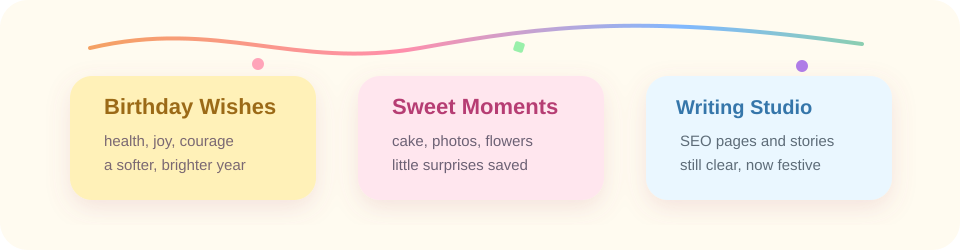
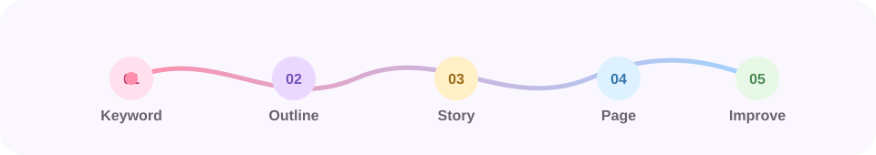

  

  <a href="https://sites.google.com/">Google Page</a> ·
  <a href="https://github.com/Lvyux1n">GitHub</a> ·
  SEO Writing · Product Stories

---

## Studio

## Language

  <table>
    <tr>
      <th align="center">English</th>
      <th align="center">Japanese</th>
      <th align="center">Chinese</th>
      <th align="center">Sichuanese</th>
    </tr>
    <tr>
      <td align="center">IELTS 7.0</td>
      <td align="center">preparing for N2</td>
      <td align="center">native</td>
      <td align="center">daily voice</td>
    </tr>
  </table>

## Article Queue

  <table>
    <tr>
      <th align="center">Status</th>
      <th align="center">Piece</th>
      <th align="center">Use</th>
    </tr>
    <tr>
      <td align="center">drafting</td>
      <td align="center">Product introduction</td>
      <td align="center">promotion page</td>
    </tr>
    <tr>
      <td align="center">planning</td>
      <td align="center">SEO article</td>
      <td align="center">Google search</td>
    </tr>
    <tr>
      <td align="center">collecting</td>
      <td align="center">Writing samples</td>
      <td align="center">portfolio</td>
    </tr>
  </table>

## Process

## Auto Tank Battle

## Links

  <table>
    <tr>
      <th align="center">Google Page</th>
      <th align="center">GitHub</th>
    </tr>
    <tr>
      <td align="center">coming soon</td>
      <td align="center"><a href="https://github.com/Lvyux1n">Lyu yuxin</a></td>
    </tr>
  </table>

  Soft voice. Clear structure. Useful pages.

